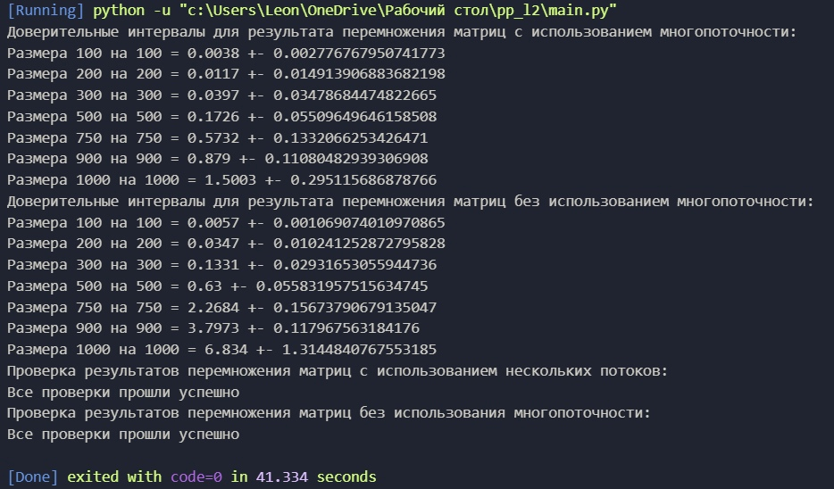

# Описание к лабораторным работам
### Лабораторная 2
***Выполнил студент группы 6312-100503D Пахомов Леонид***
___

### Условия проведения эксперементов

- [X] Стандарт ISO C++ 20 (/std:c++20)
- [X] Дополнительные библиотеки - nlohmann для работы с json
- [X] Поддержка Open MP

### Характеристики процессора

- [X] 11th Gen Intel(R) Core(TM) i5-1135G7 @ 2.40GHz
- [X] Ядра:	4
- [X] Логических процессоров:	8

### Задание на *л/р*:

- [X] Написать на С++ программу, которая создает матрицы, умножает их и записывает результаты в файлы, используя библиотеку OpenMP
- [X] Написать программу на Python, которая проверяет результат перемножений матриц на C++, вычисляет доверительные интервалы
- [X] Получить график зависимости времени вычислений от размеров матриц с использованием параллельных вычислений и сравнить с обычным

### Описание файлов
!!Файлы с матрицами удалил из проекта, дико лагал гитхаб, возможно из-за них!! Можно посмотреть в коммите
+ data - папка со значениями матриц для параллельных вычислений
+ results - папка с результатами вычислений, сделанных с помощью OpenMP
  + result_computing - папка с временем вычислений и размером для каждой матрицы
  + result-matrix - папка с результирующей матрицей (результат перемножения двух матриц)
+ data_np - папка со значениями матриц(not parallel)
+ results - папка с результатами вычислений(not parallel)
  + result_computing - папка с временем вычислений и размером для каждой матрицы
  + result-matrix - папка с результирующей матрицей (результат перемножения двух матриц)
+ main.cpp - С++ скрипт, который создает, перемножает и записывает матрицы и результаты в файл, используя для этого библиотеку omp
+ calc_checking.py - Python утилита для проверки перемножения матриц на C++
+ main.py - Python скрипт для проверки результатов C++ программы, использует calc_cheking.py (Для этого используется библиотека Numpy)
+ graph.png - График зависимости времени перемножения матриц от их размера для параллельных и обычных вычислений
___

### График зависимости:

### Проверка вычислений:

:octocat: Результаты:

В лабораторной работе были произведены 10 перемножений матриц размерами 100x100, 250x250, 300x300, 500x500, 750x750, 900x900, 1000x1000 как с использованием параллельных вычислений (OpenMP), так и без. С помощью скриптов в check.py были высчитаны доверительные интервалы для каждых 10-ти произведений, а так же проверены результаты перемножений. По результатам (особенно визуально, на графике) видно, что с размеров 300 на 300 уже отчетливо можно заметить разницу во времени, затраченную на вычисления с использованием многопоточности и без.